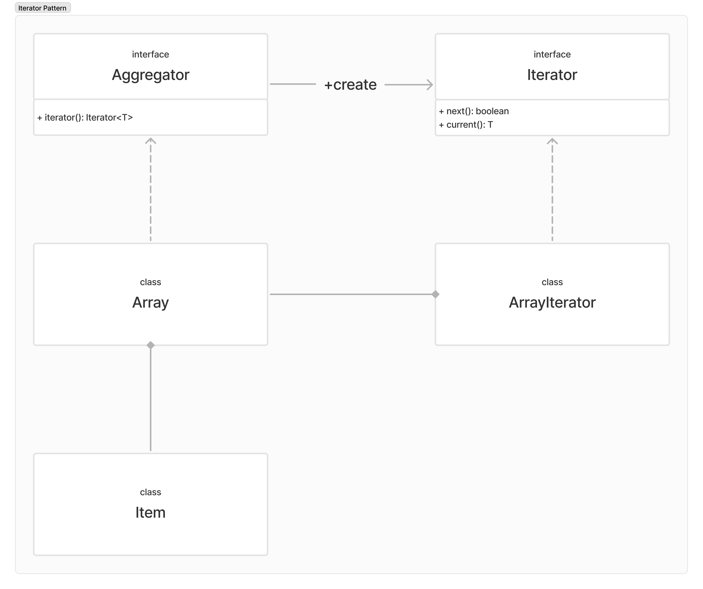
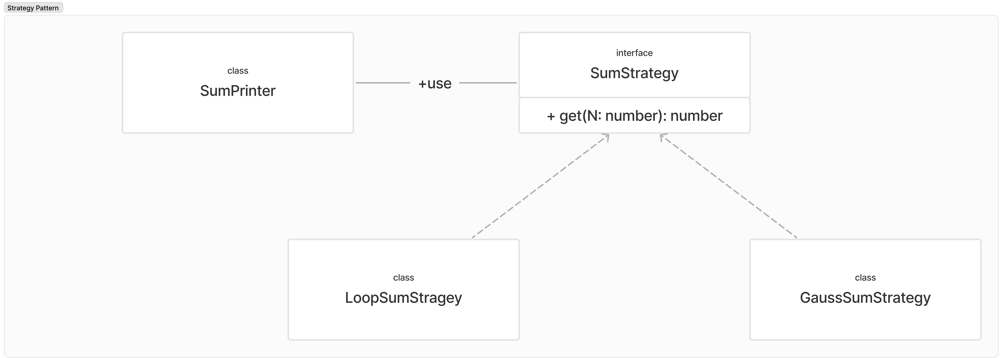

# 디자인 패턴이란

소프트웨어 설계 방법으로 개별 클래스의 기능(역할, 책임)을 명확히 정의하고, 여러 개의 클래스들 간의 관계를 효과적으로 잘 맺는 방법을 정리해 놓은 것.

**클래스 간 올바른 관계를 맺어야 하는 이유**

1. 클래스는 최소한의 단위 기능을 갖는다.
2. 큰 기능은 최소 단위 기능을 갖는 클래스들 간의 관계를 통해 개발된다.
3. 꼭 필요한 것들만으로 구성된 최적화된 소프트웨어 개발이 가능하다.
4. 문제 발생 시 원인 규명이 빠르다.
5. 최소한의 코드 수정으로 유지 보수가 가능하다.
6. 기존 기능에 영향을 주지 않고 새로운 기능 추가가 가능하다.

---

# GOF Design Pattern

가장 유용하면서 대표적인 소프트웨어 디자인 패턴 저서.

4명의 선배 개발자가 체계적으로 정리해 놓은 설계 방법으로 총 23개의 패턴으로 구성되며, 생성 패턴(5개), 구조 패턴(7개), 행위 패턴 (11개)로 분류한다.

| 생성             | 구조      | 행위                    |
| ---------------- | --------- | ----------------------- |
| Factory Method   | Adapter   | Interpreter             |
| Abstract Factory | Bridge    | Template Method         |
| Builder          | Composite | Chain of Responsibility |
| Prototype        | Decorator | Command                 |
| Singleton        | Facade    | Iterator                |
|                  | Flyweight | Mediator                |
|                  | Proxy     | Memento                 |
|                  |           | Observer                |
|                  |           | Strategy                |
|                  |           | Visitor                 |

---

# 실습 환경

- Typescript
- Visual Studio Code
- Node.js
  - webpack, webpack-cli
  - typescript, ts-loader

---

## 실습 환경 구성

Branch 실습환경 참조

`npm start`

---

# Iterator (반복자)

순회가능한 객체를 반복하는 패턴

**Aggregator(또는 Container)**

동일의 형태의 데이터 항목을 여러개 갖고 있는 것을 Aggregator또는 Container라고 한다.

**Aggregator 종류**

- Array
- Linked List
- Tree
- Graph
- Table(DBMS)
- 기타 등등

Aggregator의 구성 데이터를 가져와야할 때 Aggregator의 종류에 따라서 그 방법이 다르다. 내부 자료구조와 종류가 모두 다르기 때문이다.

## 정리

- Iterator 패턴은 배열이나 Linked-List, Tree 처럼 다른 데이터 구조를 갖는 Aggregator의 구성 항목을 표준화된 공통 API로 접근할 수있다.
- 데이터 구조가 다른 Aggregator일지라도 구성 항목을 표준화 된 공통 API로 접근할 수 있어, 하나의 공통된 알고리즘으로 처리할 수 있다.
- 기존 Javascript의 배열, 문자열등이 Iterator protocol을 통해 구현 되어있다.

---

# Strategy (전략) 패턴

프로그래밍에서 전략은 어떤 문제를 해결하기 위한 방법인 알고리즘을 의미한다. 객체의 알고리즘을 외부 객체로 분리하는 패턴이다.

- 상태 패턴과 유사하나, 전략 패턴은 자신의 전략을 스스로 바꿀 수 없다.
- 전략 객체가 간단한 경우 람다함수로 만들어 사용하면 편리하다.

SumPrinter는 인자를 받아 stategy를 사용한다. stategy interface를 상속받은 LoopSumStragy와 GaussSumStrategy는 똑같은 기능을 수행하는 두 개의 다른 알고리즘이다. SumPrinter는 두 알고리즘을 골라서 사용할 수 있는 것이다.

## 정리

- Strategy 패턴은 어떤 기능에 대한 특정 알고리즘을 느슨하게 결합시켜주는 패턴이다.
- 알고리즘이 느슨하게 결합되면 추후 더 나은 알고리즘으로 쉽게 변경할 수 있을 뿐만 아니라 프로그램 실행 중에 상황에 맞는 알고리즘으로 쉽게 변경할 수 있다.
- 기존의 알고리즘을 유지하면서 새로운 알고리즘을 효과적으로 추가할 수 있다.

---

# Template Method (서식 메서드) 패턴

일련의 과정들(실행 순서 )을 부모 클래스의 메서드로 만들어 두고, 달라지는 부분만 자식 클래스에서 재정의하는 패턴.

Article에는 읽기와 수정 기능이 있다. DisplayArticleTemplate 매서드를 만든다. 이 매서드는 추상 클래스로 각 읽기와 수정에 대한 기능을 구체적으로 구현하지 않는다. 읽기 기능은 SimpleDisplayArticle에서 수정은 EditableDisplayArticle 클래스에서 구체적으로 구현한다.

## 정리

- Template Method 패턴은 어떤 기능을 구성하는 각 실행 순서(단계)를 미리 정하고 각 실행 단계에 대한 구체적인 코드를 재정의할 수 있는 유연성을 제공한다.
- 대부분 공통인데 일부 기능만 다른 경우 활용하기 좋다.
- 가독성이 떨어지는 것이 단점.

---

# 참고

해당 프로젝트는 GIS DEVELOPER님의 유튜브 강의 영상을 참고하였습니다.
[GIS DEVELOPER - 유튜브](https://www.youtube.com/watch?v=UgtgJ486CDc&list=PLe6NQuuFBu7H3sFnErshsfgNPE9dOZZrx)
